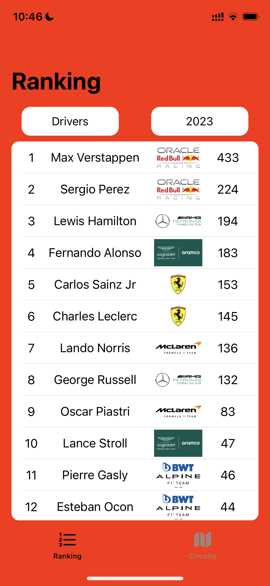
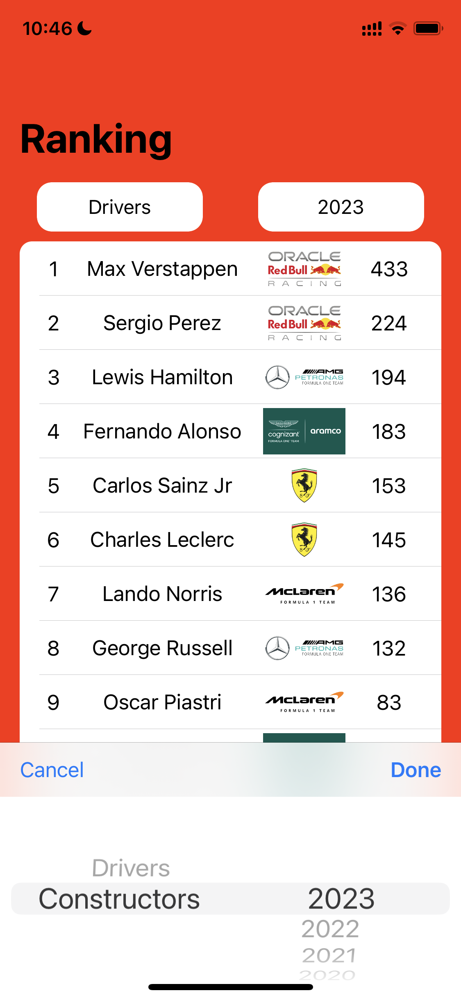
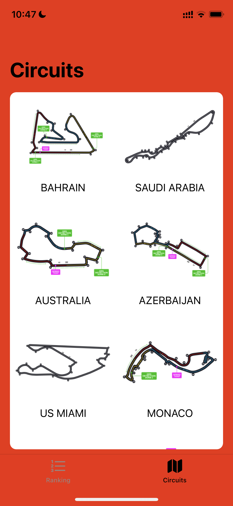
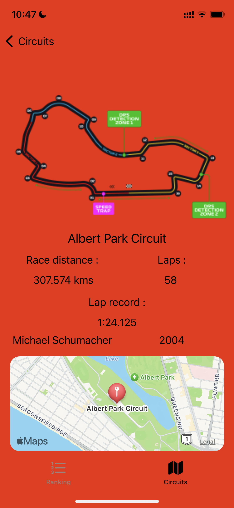

# f1_Kit
This app is for checking F1 ranking and circuit location.

Bulid with fully native Swift and MVC.

# Technologies used

iOS storyboard

GCD

Network call

MapKit

## Screenshots
 

 

## To run the app
User need to add a Key.plist file in order to run the app and add `apiKey` as key and your api key as value.

Please register your unique apiKey from https://rapidapi.com/auth/sign-up?referral=/api-sports/api/api-formula-1
